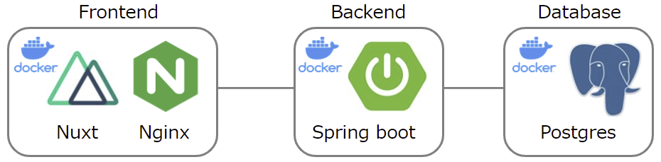
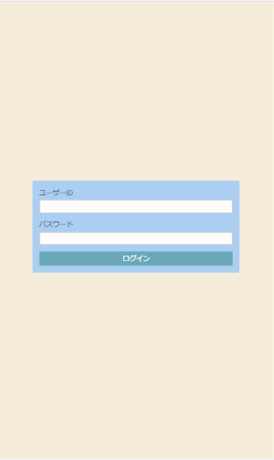
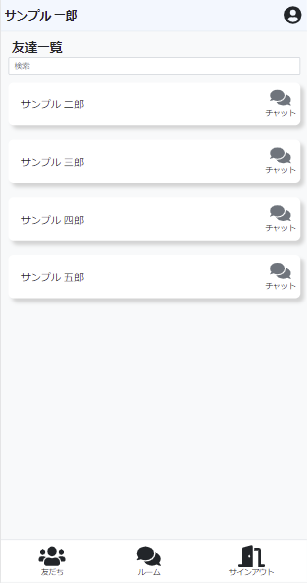
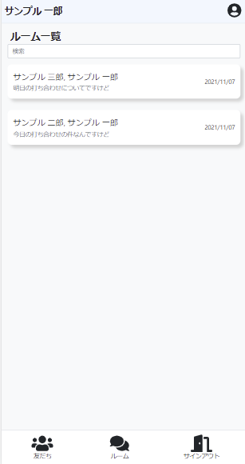
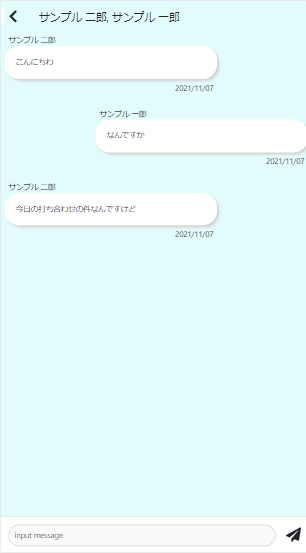

# SpringbootSample2

- WebSocketの学習用に作製したアプリです (NuxtJS/Spring boot/Postgres)
- WebSocket(Stomp)を用いてチャット機能を実装を行っています

## 設計



#### フロントエンド

- NuxtJS(Vue2) の SPA です
- Frontend/DockerfileをビルドすることでNginxコンテナが生成されます

#### バックエンド

- Spring boot で実装しています。
- Rest形式のインターフェースを公開しています
- DBアクセスは Spring Data JDBC を用いて実装しています
- Spring Security でユーザー認証機能を実装しています

#### データベース

- チャットのやり取りを永続化します
- データベースはPostgresを利用しています。

## ユーザーインターフェース

<div align="left">
  
  
  
  
</div>

## セットアップ

1. リポジトリをクローン
   ```
   git clone https://github.com/yitakura731/SpringbootSample2.git
   ```

1. Docker Compose でビルド
   ```
   docker-compose up -d --build
   ```

1. ブラウザアクセス
   ```
   http://mypc.local:81
   ```
